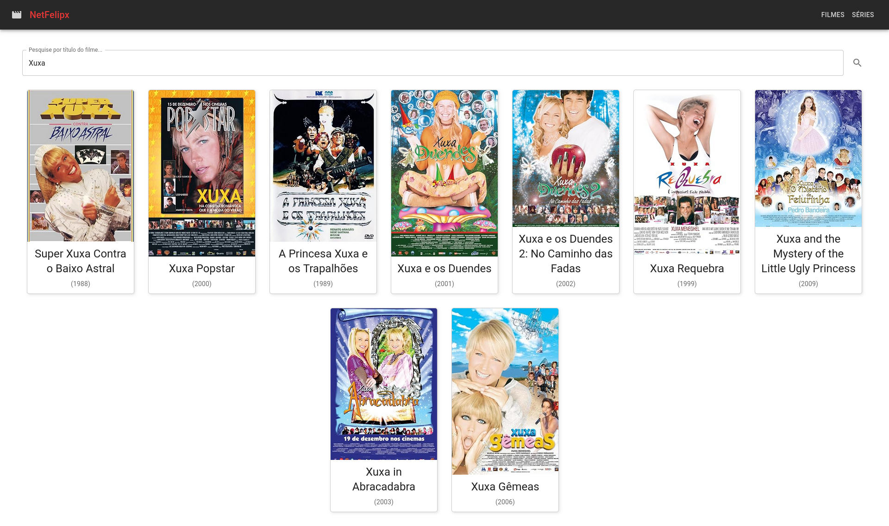
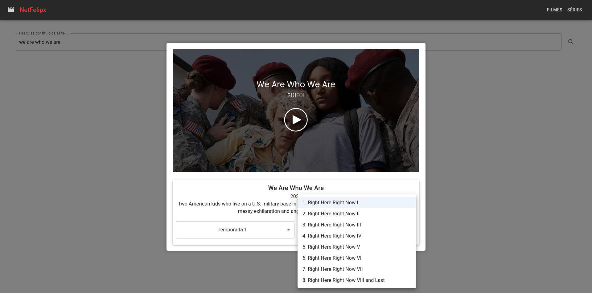

# NetFelipx

&#x20;

## Sobre o Projeto | About the Project

### ⭐ NetFelipx – Biblioteca Pesquisável de Filmes e Séries

NetFelipx é uma ferramenta desenvolvida para fins de estudo, permitindo aos usuários pesquisar por filmes e séries utilizando a API do OMDb (“The Open Movie Database”). O intuito do projeto foi aprender sobre integração de APIs e desenvolvimento de interfaces interativas. 🎥🎦

NetFelipx is a searchable library of movies and TV shows, built for study purposes. It leverages the OMDb API (“The Open Movie Database”) to provide detailed information. The purpose of this project is learning about API integration and UI development. 🎥🎦

---

## Tecnologias Utilizadas | Tech Stack

- **Frontend:** React.js 🖌
- **Backend:** Node.js com Express.js  🚀
- **API:** OMDb API  💡

---

## Como Executar | How to Run

### Requisitos

- Node.js, yarn e nodemon instalados.
- Uma chave de API válida do OMDb (registre-se em [OMDb API](https://www.omdbapi.com/)).

### Passos

1. Clone o repositório:

   ```bash
   git clone https://github.com/seu-usuario/NetFelipx.git
   cd NetFelipx
   ```

2. Instale as dependências:

   ```bash
   yarn install
   ```

3. Inicie o servidor do front:

   ```bash
   cd front/
   yarn start
   ```

4. Inicie o servidor do backend:

   ```bash
   cd server/
   nodemon index.js
   ```

5. Acesse [http://localhost:3000](http://localhost:3000) para usar o NetFelipx.

---

## Capturas de Tela | Screenshots





---

## Contato | Contact

- 📧 **E-mail:** [felipesoldatellimotta@gmail.com](mailto\:seu-email@exemplo.com)
- 📺 **LinkedIn:** [Felipe Motta](https://www.linkedin.com/in/felipe-motta-b472a4201)


